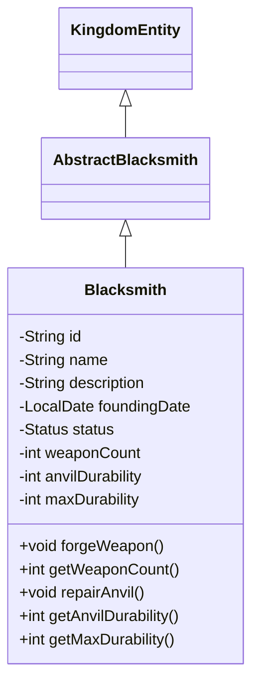

```mermaid
classDiagram

    KingdomEntity <|-- AbstractBlacksmith
    AbstractBlacksmith <|-- Blacksmith

    class Blacksmith {
        -String id
        -String name
        -String description
        -LocalDate foundingDate
        -Status status
        -int weaponCount
        -int anvilDurability
        -int maxDurability

        +void forgeWeapon()
        +int getWeaponCount()
        +void repairAnvil()
        +int getAnvilDurability()
        +int getMaxDurability()
    }
```