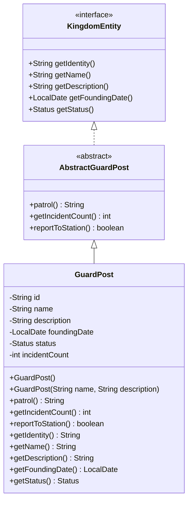

# GuardPost UML Diagram

## Design Notes

- `GuardPost` extends `AbstractGuardPost` and fulfills all required contract methods.
- The entity maintains a single piece of operational state: `incidentCount`.
- Calling `patrol()` simulates a patrol by incrementing the incident count and returning a patrol report.
- `reportToStation()` returns whether there are incidents available to report without modifying the stored incident history.
- The implementation intentionally keeps the design simple and focused on the contract while following the project's OOP conventions.