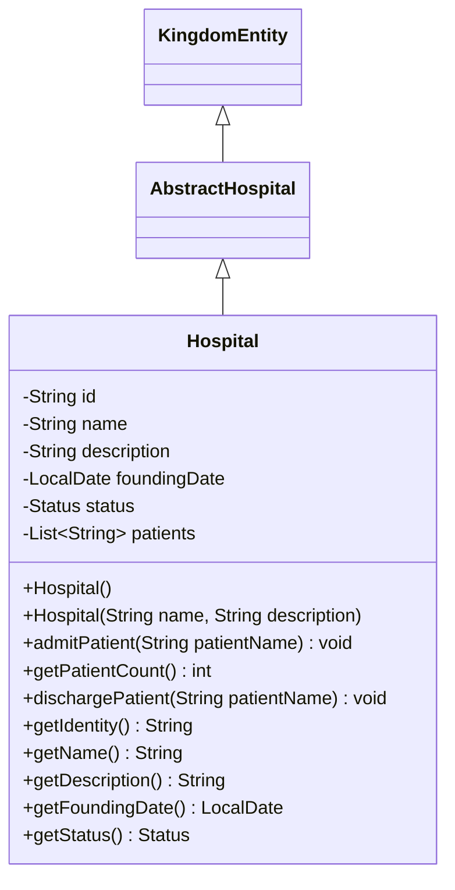

```mermaid
classDiagram

KingdomEntity <|-- AbstractHospital
AbstractHospital <|-- Hospital

class Hospital {
    -String id
    -String name
    -String description
    -LocalDate foundingDate
    -Status status
    -List~String~ patients

    +Hospital()
    +Hospital(String name, String description)

    +admitPatient(String patientName) void
    +getPatientCount() int
    +dischargePatient(String patientName) void

    +getIdentity() String
    +getName() String
    +getDescription() String
    +getFoundingDate() LocalDate
    +getStatus() Status
}
```