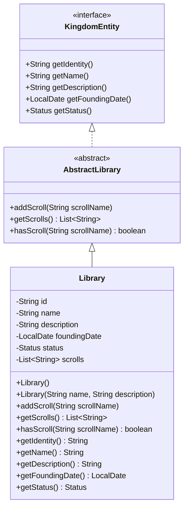

# Library UML Diagram

```mermaid
classDiagram

class KingdomEntity {
    <<interface>>
    +String getIdentity()
    +String getName()
    +String getDescription()
    +LocalDate getFoundingDate()
    +Status getStatus()
}

class AbstractLibrary {
    <<abstract>>
    +addScroll(String scrollName)
    +getScrolls() List~String~
    +hasScroll(String scrollName) boolean
}

class Library {
    -String id
    -String name
    -String description
    -LocalDate foundingDate
    -Status status
    -List~String~ scrolls

    +Library()
    +Library(String name, String description)

    +addScroll(String scrollName)
    +getScrolls() List~String~
    +hasScroll(String scrollName) boolean

    +getIdentity() String
    +getName() String
    +getDescription() String
    +getFoundingDate() LocalDate
    +getStatus() Status
}

KingdomEntity <|.. AbstractLibrary
AbstractLibrary <|-- Library
```
