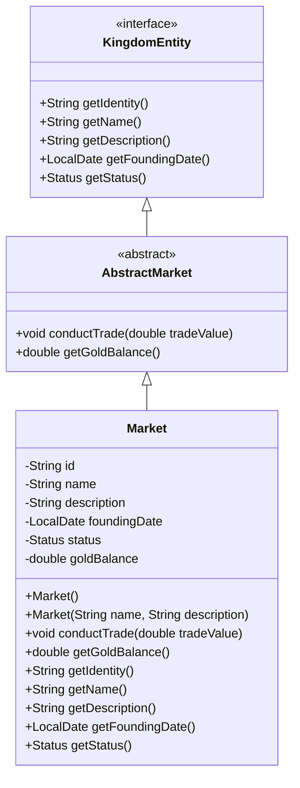

# Market UML Diagram

```mermaid
classDiagram
    class KingdomEntity {
        <<interface>>
        +String getIdentity()
        +String getName()
        +String getDescription()
        +LocalDate getFoundingDate()
        +Status getStatus()
    }

    class AbstractMarket {
        <<abstract>>
        +void conductTrade(double tradeValue)
        +double getGoldBalance()
    }

    class Market {
        -String id
        -String name
        -String description
        -LocalDate foundingDate
        -Status status
        -double goldBalance
        +Market()
        +Market(String name, String description)
        +void conductTrade(double tradeValue)
        +double getGoldBalance()
        +String getIdentity()
        +String getName()
        +String getDescription()
        +LocalDate getFoundingDate()
        +Status getStatus()
    }

    KingdomEntity <|-- AbstractMarket
    AbstractMarket <|-- Market
```