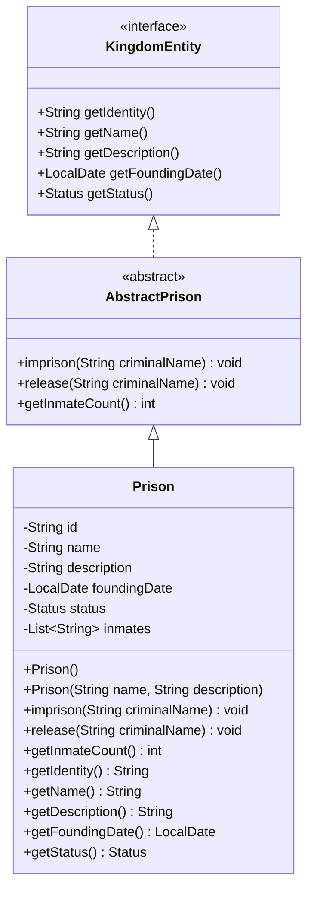

# Prison UML Diagram

## Design Notes

The `Prison` entity models a secure facility responsible for managing inmates within the kingdom.

### Design Decisions

* The prison maintains a `List<String>` of inmate names instead of a separate integer counter.
* The inmate count is derived directly from the collection using `getInmateCount()`, avoiding redundant state.
* `imprison(String criminalName)` validates the input, ignores null or blank names, trims whitespace, and prevents duplicate inmates.
* `release(String criminalName)` safely removes an inmate if present and ignores invalid or unknown names.
* The implementation keeps the class focused on its core responsibility while remaining simple, predictable, and consistent with the project's object-oriented design principles.
