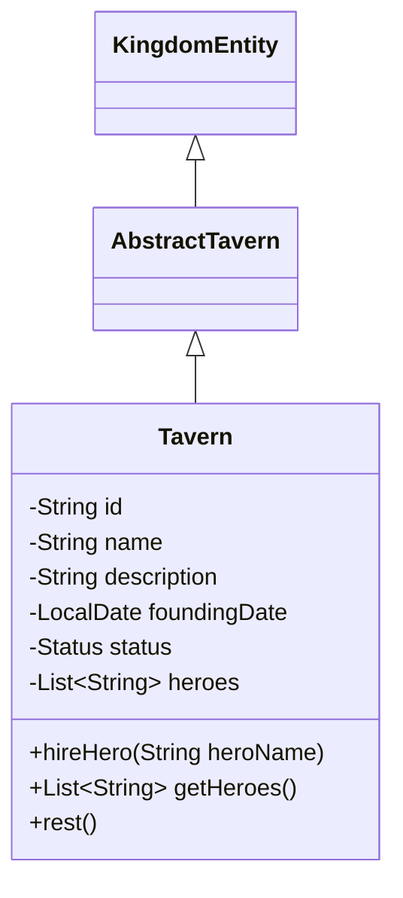

```mermaid
classDiagram

KingdomEntity <|-- AbstractTavern
AbstractTavern <|-- Tavern

class Tavern {
    -String id
    -String name
    -String description
    -LocalDate foundingDate
    -Status status
    -List~String~ heroes

    +hireHero(String heroName)
    +List~String~ getHeroes()
    +rest()
}
```